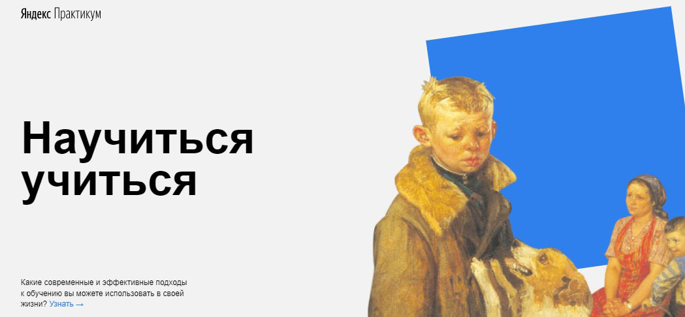

# Проект:How to Learn(Научится учиться).
---

Информация на сайте разделена на блоки. В ряде блоков присутсвуют ссылки на дополнительную информацию, литературу, а так же на полезные ресурсы. Ссылки дополнены псевдоклассами и кликабельны. На сайте реализована анимация фона двух блоков. Используются технологии построения сеток flex и grid.

*Данный проект создавался на двух языках*  
 &nbsp;
 &nbsp;

## Используемые технологии:

- Построение flexbox-сеток
- Позиционирование элементов
- Анимация
- Встраиваемый контент iframe
В проектной работе были разбиты блоки на отдельные папки по **БЭМ**.

## Используемые программы:
- VSCode
- GitHub Desktop
- CodePen
- Validation Servise

[ПРОЕКТ:How to Learn](https://miskevichstanislav.github.io/how-to-learn/)
